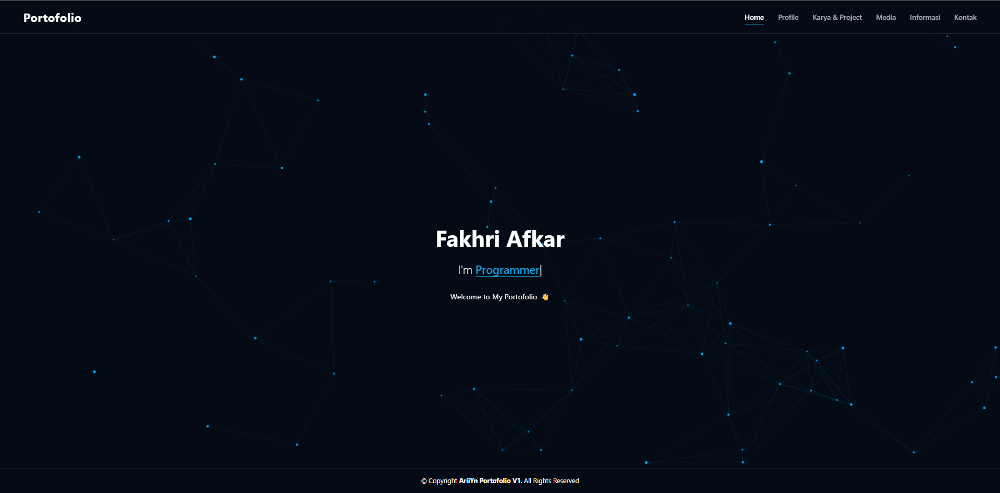

# 🚀 AriiYn Portofolio V1


> **Personal Portfolio Website.**
> Dibangun sepenuhnya menggunakan *Vanilla Web Technologies* (Tanpa Framework CSS/Bootstrap). Ringan, cepat, dan terstruktur rapi.

---

## 📸 Preview
*(Ganti bagian ini dengan screenshot website kamu setelah jadi)*


---

## ✨ Fitur Utama

Project ini menonjolkan estetika kode murni dengan fitur interaktif:

* **⚡ Pure Native Code:** Tidak menggunakan library CSS (Bootstrap/Tailwind). Semua styling ditulis manual (`style.css`, `profile.css`, dll) untuk performa maksimal.
* **✨ Interactive Animations:**
    * **Typing Effect:** Efek mengetik otomatis pada halaman utama.
    * **Particle Canvas:** Background animasi partikel interaktif menggunakan HTML5 Canvas.
* **📱 Fully Responsive:** Navigasi dengan *Hamburger Menu* kustom untuk tampilan mobile.
* **📂 Multi-Page Architecture:** Struktur halaman terpisah (`index`, `profile`, `karya`, dll) agar kode lebih modular dan mudah dikelola.
* **🌙 Modern UI:** Desain antarmuka gelap/elegan dengan fokus pada tipografi dan konten.

---

## 🛠️ Struktur Folder

Struktur proyek disusun secara modular agar aset mudah diatur:

```text
MYWEBPORTO/
│
├── assets/
│   ├── css/                  # Styling untuk setiap halaman
│   │   ├── style.css         # CSS Utama
│   │   ├── profile.css
│   │   ├── karya.css
│   │   ├── media.css
│   │   ├── informasi.css
│   │   └── contact.css
│   │
│   ├── js/                   # Logika JavaScript
│   │   ├── script.js         # Script Utama (Toggle & Animations)
│   │   ├── karya.js
│   │   └── ...
│   │
│   ├── img/                  # Aset Gambar & Foto Profil
│   └── media/                # Aset Audio/Video/Dokumen
│
├── index.html                # Halaman Utama (Home)
├── profile.html              # Halaman Profil
├── karya.html                # Halaman Project
├── media.html                # Halaman Galeri
├── informasi.html            # Halaman Informasi
└── kontak.html               # Halaman Kontak
